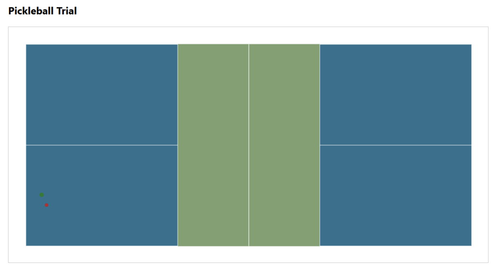
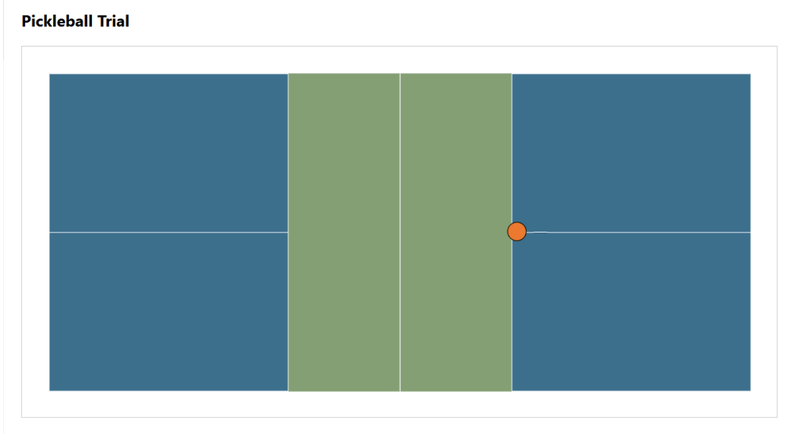
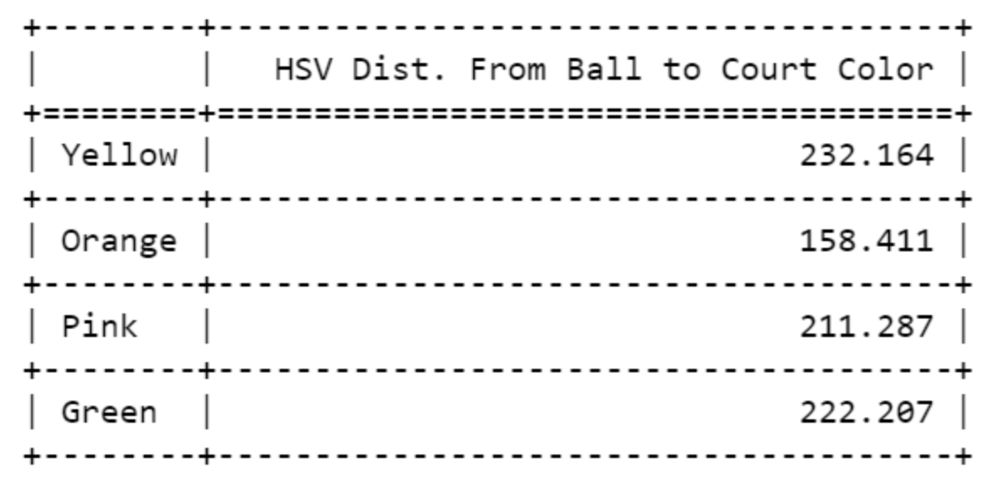
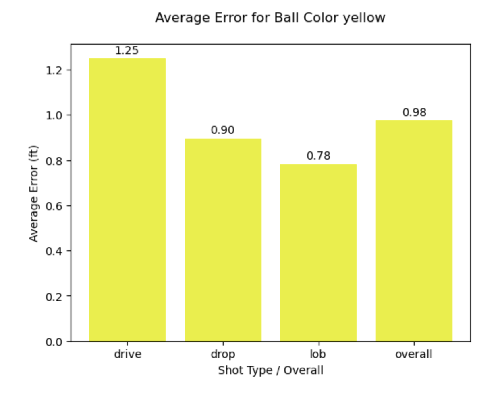
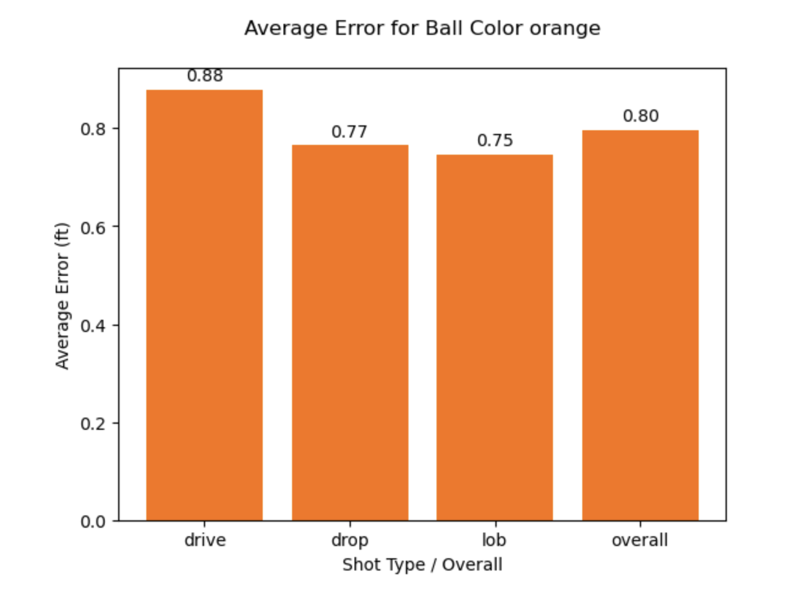
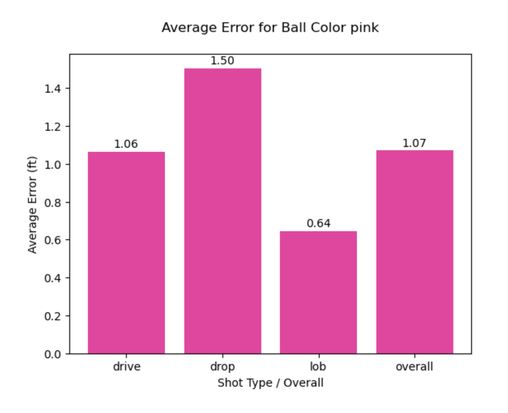
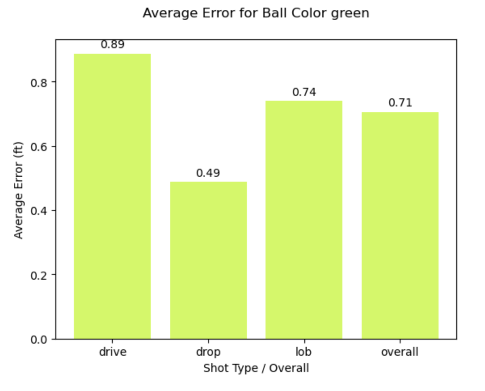
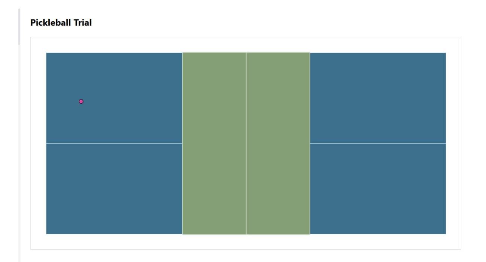
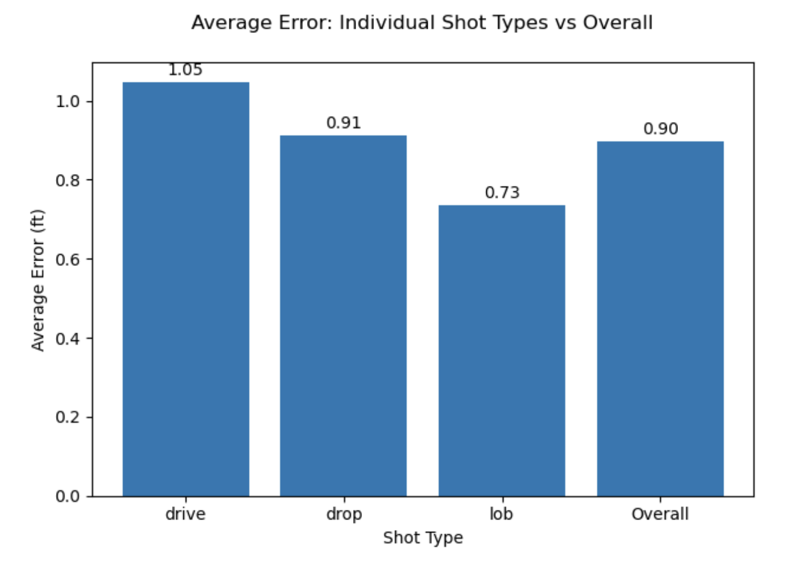

# CS 573 — A3: DataVis Experiment

## Working Link
[https://ajensen544.github.io/Datavis-pickle/](https://ajensen544.github.io/Datavis-pickle/)

## Team
- Aksel Jensen
- Zack Gluck
- Jacob Burns

## Overview 

For our Assignment 3 project we chose to deviate a bit from the Cleveland-McGill to really go beyond. We designed our own revisit site outside of the template and our own d3 component trial of a pickleball court physics animation. In each trial the ball gets hit across the court and lands in a specific position; the user's job is to select or estimate where the ball landed on the court. The error is the distance (“ft”) from the actual predicted location. In each trial, the randomized conditions are shown in ball travel distance, ball color, and ball location.  

Clicking the court: Red dot is user guess, Green dot is actual landing location 

 

## Condition 1: Ball Color 

In this trial, the ball color varies by a variety of different preset options that reflect near real court and ball colors. The hypothesis for this case generally is that the similarity between colors of the court and the ball will have an effect on people's accuracy. The closer together the ball color is to the court color, the greater the error will be between selection location and actual location.  

Variation in Ball color 

 

## Condition 2: Shot type 

In this trial, the shot type varies by ball location, depth, speed, and angle, from a set of preset options reflecting real pickleball shots including lob, drives and drops. For example, there is a shot type where the ball is slow and lands towards the kitchen (drop), and there is another shot where it goes deeper toward the backline and is quite fast (drive). The hypothesis here is that the speed of the ball will have an effect on accuracy. The faster the ball moves, the greater the error will be. 

Variation in shot type (drive) 

## Design Achievement 

Our design achievement is our deviation from and implementing a new novel Cleveland McGill-esque d3 component of a pickleball court animation that looks like a court and takes in interactable parameters. Additionally, we played a game of pickleball together to simulate shots and understand physics. 

## Technical Achievement 

Our technical achievement is building up a revisit study from scratch without using the Cleveland McGill template and incorporating the pickle trial react component to handle clicking on the screen to designate where the ball landed and calculate the distance. 

